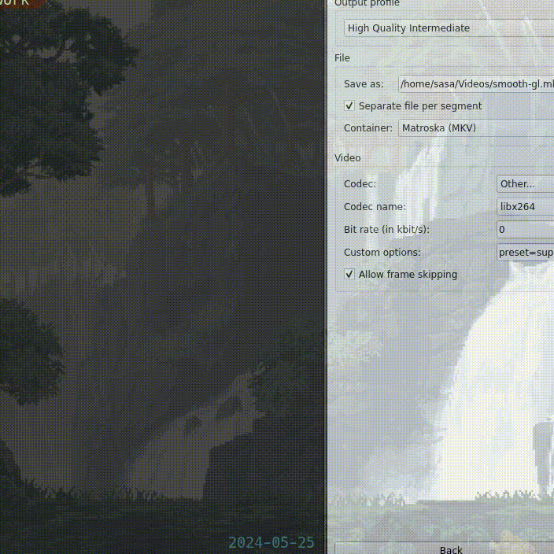

# gfx framework
## deps:-
- opengl and glfw
## info:-
a simple graphics library for writing graphics apps with opengl. this lib provides a good abstraction for OpenGL
(to be fair abstractions are usually bad, I try to make it usable and less abstract now).
## getting started:- 
- you will need to build this lib from source.
- install deps.
- run (make install)
## more projects based on this one?
I have some projects done based on this lib which will have its own repo
## newer OpenGL?
you may have a higher opengl version than that specified in gfx::context.
you are free to use what version but remember to use up to date shaders as well.
you may want to use core profile. so add it in the gfx::context::init under glfw version window hint

## You can now use Textures!!
NOTE: we substituted gfx::attributes with gfx::(vertex_type)::attributes to provide ability to work
with different vertex_types with different shaders.

