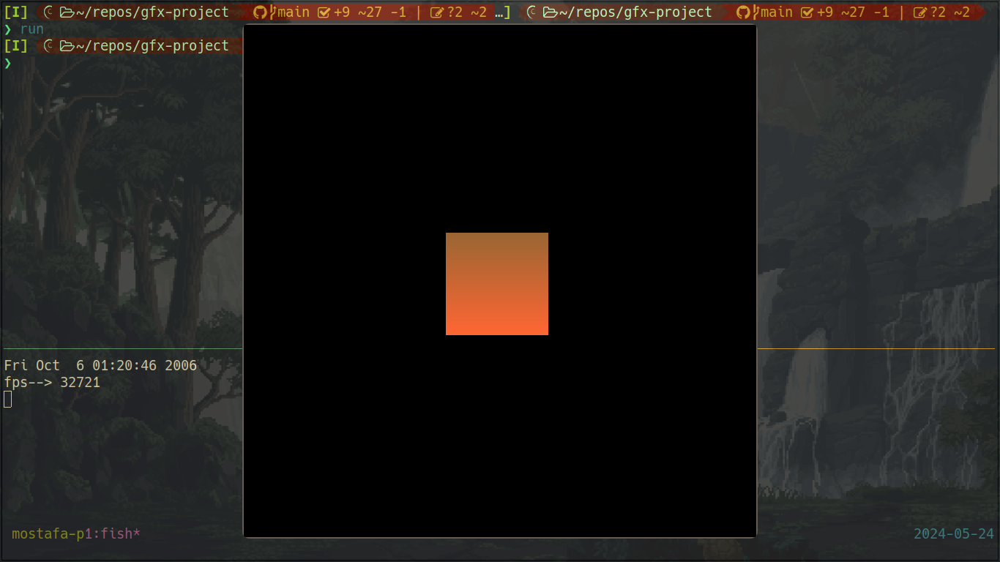

# gfx framework
## deps:-
- opengl and glfw
## info:-
a simple graphics library for writing graphics apps with opengl. this lib provides a good abstraction for OpenGL
## getting started:- 
- you will need to build this lib from source.
- install deps.
- run (make install) after running cmake for sure.
## more projects based on this one?
I have some projects done based on this lib which will have its own repo
## newer OpenGL?
you may have a higher opengl version than that specified in gfx::context.
you are free to use what version but remember to use up to date shaders as well.
you may want to use core profile. so add it in the gfx::context::init under glfw version window hint

## update
we added:
- gfx::box which can be added to gfx::buffer with a single append call and modified.
- gfx::lerp version for gfx::rgba and gfx::rgb (colors)
- animation task with gfx::task also a gfx::mid_task.
- a queue for animation gfx::task and gfx::mid_task. (which uses std::vector btw)

you can now make cool animations with gfx and interpolators.
interpolators now have:
- gfx::cubic namespace with:
 + ease_in
 + ease_out
 + ease_inout

